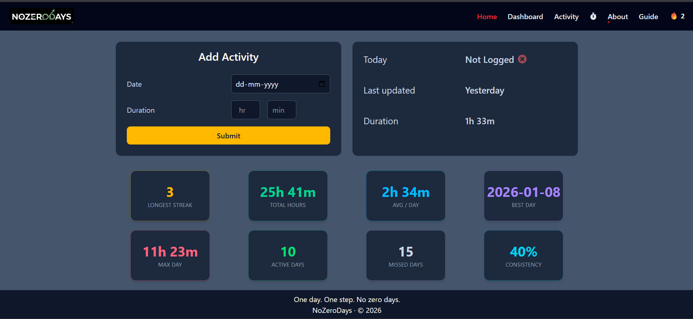

# NoZeroDays

NoZeroDays is a simple, local-first productivity app built to help you stay consistent.  
The idea is straightforward: even small progress counts — just don’t let a day go by with zero effort.

The app focuses on speed, simplicity, and privacy, with no accounts, no backend, and no distractions.

## 🚀 Live Demo

🔗 https://react-no-zero-days-app.vercel.app/

## ✨ Features

- Track daily progress effortlessly
- Clean, minimal, distraction-free UI
- Fully responsive (mobile & desktop)
- Fast performance with no backend
- Privacy-friendly: data stays on your device

## ⚠️ Important Note About Data Storage

This app uses **browser localStorage** to store all user data.

- Your progress is saved only on the current device and browser
- Clearing browser storage or site data will permanently erase progress
- There is no cloud sync or account system by design

Please avoid clearing browser data if you wish to keep your progress.

## 🖥️ Desktop Preview



## 🛠️ Tech Stack

- React
- TypeScript
- Vite
- Tailwind CSS
- Browser localStorage
- Vercel (Deployment)

## 📦 Getting Started

### Prerequisites

- Node.js (v16 or later)
- npm or yarn

### Installation

```bashgit clone https://github.com/your-username/nozerodays.git
cd nozerodays
npm install
npm run dev

### 🤝 Contributing

Contributions are welcome.
If you’d like to improve the app, feel free to fork the repository and submit a pull request.

### 🧑‍💻 Author

Hafeez Mohammad
Frontend Developer


📜 License
This project is licensed under the MIT License.
```
